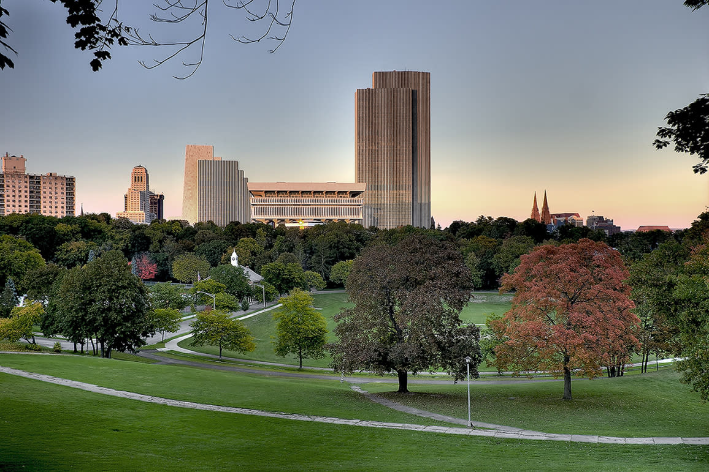

# Linkin Park
## Description
Rob Bourdon, Brad Delson, Mike Shinoda, Dave Farrell, and Joe Hahn love going on walks. Something about being Numb in the Chicago weather (where the park is in the picture) that refreshes the band member's heads. Breaking the Habit of leaking the album covers, the band has opted to be secure in sharing their covers. However, In the End, Brad forgot to send the plain photo to his girlfriend. Thanks, Brad. Can you find the flag?

## Solution
Whenever I get an image in a forensics challenge, I run `file` to make sure the file contents match the extension (not guaranteed to be accurate, but it works in most cases). In this case, running `file linkinPark.jpg` says it's JPEG image data, so no extension renaming tricks here. Viewing the file doesn't seem to yield any secrets either, so we try another tool: `binwalk`. `binwalk` will look for files embedded inside other files, extracting candidates. Running `binwalk -Me linkinPark.jpg` (`M` is for repeating the process on extracted files, and `e` is for automatic extraction) creates a new directory named `_linkinPark.jpg.extracted` with a very sus `cover` directory. Viewing `cover/newAlbumCover.jpg` gives us the flag.

Flag: `gigem{b1nw4lk_1s_c00l}`
